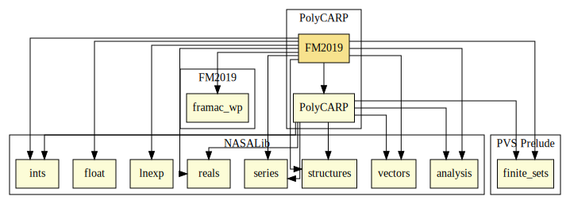

# Analysis of the Floating-Point Calculation of the Winding Number 

This library presents an analysis on the Winding Number function from PolyCARP presented in [1].

The following theories contain a real-arithmetic formalization of the Winding Number.

* `winding_number__real`: declares the main function (Winding Number)
* `winding_number_rec__real`: declares an auxiliar recursive function needed to calculate the Winding Number
* `winding_number_contrib__real`: declares the function that computes each step of the recursion mentioned above
* `quadrant__real`: declares a simple function determining the quadrant a given point is in

The proof of equivalence to the Winding Number functions from the [PolyCARP repository] can be found in the `winding_number__real` theory.

Additionally, an alternative version of the real-valued Winding Number functions defined using the iteration mechanism declared in the [for_iterate] library is also provided in `winding_number__real_for_basic`. The theory `winding_number__real_for_basic_props` contains proofs of equivalence to the function defined on the recursive helper (from `winding_number_rec`).

The technique presented in [1] have been modified in order to be able to deal with function calls, (simple) recursion, and compound datatypes (such as _arrays_). As part of the analysis, the PRECiSA static analyzer was modified in order to produce a C floating-point version of the result of the application of the transformation to a function such as the one defined in `winding_number__real_for_basic`. Following [1], every transformed function in these theories must be such that if it returns a non-warning value, such value is equal to the one returned by the real and the floating-point original versions. The resulting C program also contains ACSL annotations stating the desired property for each transformed function. A plugin for the Frama-C/WP analyzer was also developed in order to automatically generate PVS formalizations representing the verification conditions resulting from the analysis of the C program. These automatically-generated verification conditions, along with their interactively-constructed proofs, can be found in the following theories.

* `Compound` : trivial memory model
* `S8_maybeInt` : Axiomatic definition of the result type (warning or value)
* `A_real_function_for_winding_number1` : Axiomatic real-valued definition of the Winding Number function
* `A_real_function_quadrant` : Axiomatic real-valued definition of the Quadrant function
* `A_real_function_winding_number` : Axiomatic real-valued definition of the entry point for the Winding Number function
* `A_real_function_winding_number_contrib` : Axiomatic real-valued definition of the contribution of each iteration in the Winding Number function
* `quadrant_int_post` : Postcondition of the quadrant function
* `winding_number_contrib_int_post` : Postcondition of the contribution function
* `winding_number_int_loop_inv_established` : Verification condition from the _for_ loop in the Winding Number function
* `winding_number_int_loop_inv_preserved` : Verification condition from the _for_ loop in the Winding Number function
* `winding_number_int_post` : Postcondition for the Winding Number function
* `interface` : Proof of equivalence between the axiomatic version and the definitions in `winding_number__real_for_basic`

From the proofs in `interface`,  `winding_number__real_for_basic_props`, and `winding_number__real`, it can be concluded that if the C program generated by PRECiSA returns a non-warning value, it returns the same value that the real-valued version returns on the same inputs.

# Contributors
* Mariano M. Moscato, NIA, USA

## Maintainer
* [César Muñoz](http://shemesh.larc.nasa.gov/people/cam), NASA, USA 

# Dependencies

---

1. Moscato M.M., Titolo L., Feliú M.A., Muñoz C.A. (2019) Provably Correct Floating-Point Implementation of a Point-in-Polygon Algorithm. In: ter Beek M., McIver A., Oliveira J. (eds) Formal Methods – The Next 30 Years. FM 2019. Lecture Notes in Computer Science, vol 11800. Springer, Cham. https://doi.org/10.1007/978-3-030-30942-8_3

[PolyCARP repository]: ../PolyCARP/polygon_contain.pvs

[high-level floating-point formalization from the NASALib]: https://github.com/nasa/pvslib/tree/master/float

[for_iterate]: https://github.com/nasa/pvslib/blob/master/structures/for_iterate.pvs
