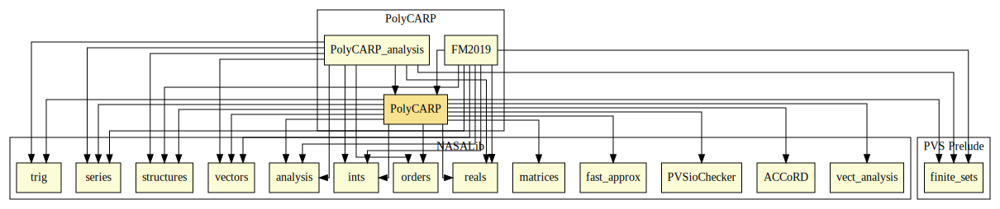

# PolyCARP

# Contributors
* Anthony Narkawicz, formerly at NASA

## Maintainer
* [César Muñoz](http://shemesh.larc.nasa.gov/people/cam), NASA, USA

# Dependencies

---

1. Anthony Narkawicz, César Muñoz, and Aaron Dutle, [The MINERVA Software Development Process](https://shemesh.larc.nasa.gov/fm/PolyCARP/MINERVA.pdf), Automated Formal Methods, 2017.

2. Anthony Narkawicz and George Hagen, Algorithms for Collision Detection Between a Point and a Moving Polygon, With Applications to Aircraft Weather Avoidance, AIAA Aviation 2016, June 13-17, 2016, Washington, D.C. 
