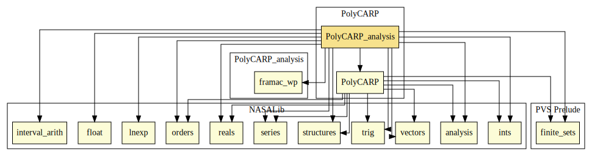

# Analysis of the Floating-Point Calculation of the Winding Number 

This library shows an analysis on the Winding Number function from PolyCARP, based on the technique presented in [1].

The following theories contain a real-valued formalization of the Winding Number.

* `winding_number__real`: declares the main function (Winding Number)
* `winding_number_rec__real`: declares an auxiliar recursive function needed to calculate the Winding Number
* `winding_number_contrib__real`: declares the function that computes each step of the recursion mentioned above
* `quadrant__real`: declares a simple function determining the quadrant a given point is in

The proof of equivalence to the Winding Number functions from the [PolyCARP repository] can be found in the `winding_number__real` theory.

The floating-point versions of the above declarations are defined in the following theories.

* `winding_number`
* `winding_number_rec`
* `winding_number_contrib`
* `quadrant`

These theories depend on the [high-level floating-point formalization from the NASALib]. Compound floating-point based datatypes corresponding to the ones handled by the real-valued version of the Winding Number functions, such as _point_ and _polygon_, are defined in the theories `acceptable_polygon` and `vectors_2D_fp_def`.

The technique presented in [1] have been modified in order to be able to deal with function calls, (simple) recursion, and compound datatypes (_point_, _polygon_). The result of the application of such modified technique on the Winding Number functions is declared in the theories mentioned below.

* `winding_number__trans`
* `winding_number_rec__trans`
* `winding_number_contrib__trans`
* `quadrant__trans`

Following [1], every transformed function in these theories must be such that if it returns a non-warning value, such value is equal to the one returned by the real and the floating-point original versions. The proof of such property for each function is formalized in the corresponding `_props` theory.

* `winding_number__trans_props`
* `winding_number_rec__trans_props`
* `winding_number_contrib__trans_props`
* `quadrant__trans_props`

Additionally, a couple of versions of real-valued Winding Number functions defined using the iteration mechanism declared in the [for_iterate] library are also provided in the following theories.

* `winding_number__real_for`: functions over compound datatypes
* `winding_number__real_for_basic`: functions over basic datatypes

The theory `winding_number__real_for` contains proofs of equivalence to the recursive version of the functions (from `winding_number_rec`). Similar proofs for the basic datatype version can be found in `winding_number__real_for_basic_props`.

As part of the analysis, the PRECiSA static analyzer was modified in order to produce a C floating-point version of the result of the application of the transformation to a function such as the one defined in `winding_number__real_for_basic`. The resulting C program also contains ACSL annotations stating the desired property for each transformed function. A plugin for the Frama-C/WP analyzing framework was also developed in order to automatically generate PVS formalizations representing the verification conditions resulting from the analysis of the C program. These automatically-generated verification conditions, along with their interactively-constructed proofs, can be found in the following theories.

* `Compound` : trivial memory model
* `S8_maybeInt` : Axiomatic definition of the result type (warning or value)
* `A_real_function_for_winding_number1` : Axiomatic real-valued definition of the Winding Number function
* `A_real_function_quadrant` : Axiomatic real-valued definition of the Quadrant function
* `A_real_function_winding_number` : Axiomatic real-valued definition of the entry point for the Winding Number function
* `A_real_function_winding_number_contrib` : Axiomatic real-valued definition of the contribution of each iteration in the Winding Number function
* `quadrant_int_post` : Postcondition of the quadrant function
* `winding_number_contrib_int_post` : Postcondition of the contribution function
* `winding_number_int_loop_inv_established` : Verification condition from the _for_ loop in the Winding Number function
* `winding_number_int_loop_inv_preserved` : Verification condition from the _for_ loop in the Winding Number function
* `winding_number_int_post` : Postcondition for the Winding Number function
* `interface` : Proof of equivalence between the axiomatic version and the definitions in `winding_number__real_for_basic`

From the proofs in `interface`,  `winding_number__real_for_basic_props`, and `winding_number__real`, it can be concluded that if the C program generated by PRECiSA returns a non-warning value, it returns the same value that the real-valued version would have returned on the same inputs.

# Contributors
* Mariano M. Moscato, NIA, USA

## Maintainer
* [César Muñoz](http://shemesh.larc.nasa.gov/people/cam), NASA, USA 

# Dependencies

---

1. Laura Titolo, César A. Muñoz, Marco A. Feliú, and Mariano M. Moscato.  “Eliminating Unstable Tests in Floating-Point Programs”. In: CoRR abs/1808.04289. Pre-proceedings of the 28th International Symposium on Logic-based Program Synthesis and Transformation, LOPSTR 2018, Frankfurt am Main, Germany. arXiv: 1808.04289. url: http://arxiv.org/abs/1808.04289

[PolyCARP repository]: ../PolyCARP/polygon_contain.pvs

[high-level floating-point formalization from the NASALib]: https://github.com/nasa/pvslib/tree/master/float

[for_iterate]: https://github.com/nasa/pvslib/blob/master/structures/for_iterate.pvs
